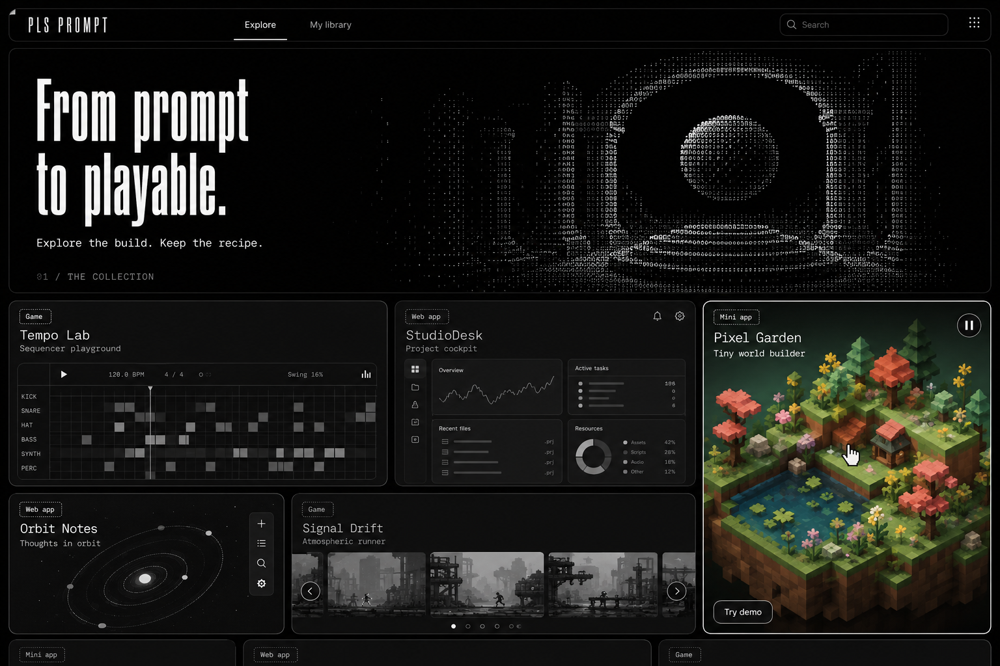

# PLS PROMPT Design System

Version 1.0 · September 5, 2026 · Selected direction: ASCII Atelier

This is the design specification for the recipe-gallery pivot. The user selected [ASCII Atelier](design-explorations/02-ascii-atelier.png) from the four generated mockups. That image establishes the visual direction; this document defines the behavior, responsive rules, and reusable parts that a static mockup cannot show.

The specification is complete for implementation. It has not been applied to the application or verified in a working browser interface. The existing application, data, authentication, and lesson routes remain unchanged by this documentation task. The [active pivot plan](pivot-plan.md) governs product scope and delivery.

A [machine-readable token file](design-system.tokens.json) accompanies this document. It is a documentation artifact, not a stylesheet currently loaded by the site.

The image above is the approved composition reference; its projects and hover state are illustrations.

## 1. The defining idea

**An almost monochrome gallery that comes alive when someone gets curious.**

The site presents working projects and the recipes used to make them. The interface stays quiet so the project can become the point of attention. ASCII gives the brand its character; a bento grid gives projects room to vary; color marks the preview someone is exploring.

The core journey is **Explore → try the project → get the recipe → make it your own**.

### Decisions from the selected reference

- Near-black page and surfaces, white headings, gray supporting text, and fine borders.
- A wide architectural ASCII hero, with an arch and suspended sphere as the initial motif.
- Tall, condensed display typography paired with readable monospace interface text.
- A bento gallery with varied card proportions and consistent gaps.
- Selected cards containing slowly scrolling carousels of project previews.
- Grayscale preview images at rest; their original color appears on hover or keyboard focus.
- The hovered or focused card's carousel stops immediately, preserving its current position.
- Simple navigation centered on Explore and My Library.

These decisions supersede the previous orange, lavender, and lime interface palette, serif display headlines, and lesson-first visual hierarchy when the new experience is implemented.

### Translate the reference into a real product

Keep the hierarchy and atmosphere of the selected image. Make its small labels larger, use real text instead of text embedded in graphics, and give controls usable target sizes. The generated project's names, metrics, category labels, content, and build claims are illustrative; they are not approved catalog data.

Use original ASCII assets and verified project imagery. The other three generated directions remain exploration history; they are not competing design systems. The fourth image can inform the division between preview and recipe, but its serif headings and other styling do not override this selected direction.

## 2. Brand and voice

The public brand is **PLS PROMPT**. Use the condensed display face in uppercase with deliberate spacing for the initial wordmark. Keep the mark white or near-white on dark surfaces. Provide a text label or accessible name when it links home.

The hero copy for the first implementation is:

- Headline: **From prompt to playable.**
- Supporting line: **Explore the build. Keep the recipe.**

Use plain, direct interface language. Name the project, its purpose, the recipe format, and the next useful action. Keep explanations about tools, setup, and limitations close to the recipe. Treat visitors as capable people who may be new to prompting.

Approved core labels: **Explore**, **My Library**, **Search projects**, **Try demo**, **Open demo**, **Get recipe**, **Copy prompt**, **Copy step**, **Copy all prompts**, **Download recipe**, **Download pack**, **Download skill**, **Save recipe**, **Saved**, **How it was made**, **What to customize**, and **Known limits**.

Use the format name that accurately describes the download. A skill needs a download or installation action; do not imply that copying its entry text includes all required files. Avoid unexplained quality scores, mastery language, generic promotional badges, and premium claims without supporting build evidence.

## 3. Color and contrast

### Interface palette

Every interface color is neutral grayscale. Product imagery supplies the only chromatic color. Do not tint the navigation, buttons, links, selection states, focus rings, or status messages with a project's colors.

| Token | Value | Role |
| --- | --- | --- |
| `color.canvas` | `#080808` | Page background |
| `color.surface` | `#111111` | Hero, cards, primary panels |
| `color.surfaceHover` | `#181818` | Hovered surface and quiet controls |
| `color.surfaceRaised` | `#202020` | Menus, dialogs, active input surroundings |
| `color.surfaceInset` | `#0C0C0C` | Prompt text and media gutters |
| `color.border` | `#383838` | Decorative panel separation |
| `color.controlBorder` | `#777777` | Input boundaries and controls needing visible outlines |
| `color.text` | `#F2F2F2` | Headings, primary text, active icons |
| `color.textSecondary` | `#B8B8B8` | Body/supporting text |
| `color.textMuted` | `#949494` | Metadata and placeholders |
| `color.textDisabled` | `#707070` | Unavailable controls only |
| `color.action` | `#F2F2F2` | Primary button background |
| `color.actionText` | `#111111` | Text and icons on primary buttons |
| `color.focus` | `#F2F2F2` | Keyboard focus outline |

The decorative border is intentionally subtle. It must not be the only way to identify an input, a selected option, or an actionable control. Use the stronger control border, readable labels, and visible state changes for those roles.

Computed solid-color ratios for these tokens are 16.87:1 for primary text on the main surface, 8.21:1 for secondary text on the raised surface, 5.37:1 for muted text on the raised surface, and 3.64:1 for the control border against the raised surface. These calculations validate token pairs, not every future composition.

Require at least 4.5:1 for ordinary text and 3:1 for required control boundaries and visual state indicators. Recheck overlays against their actual backgrounds. See the primary guidance for [text contrast](https://www.w3.org/WAI/WCAG22/Understanding/contrast-minimum.html) and [non-text contrast](https://www.w3.org/WAI/WCAG22/Understanding/non-text-contrast.html).

### Color belongs to the preview

Apply grayscale only to the media wrapper, not the whole card. This preserves the contrast of its title, buttons, and focus indicator. Keep original color assets and use presentation filtering instead of storing only desaturated copies.

A selected project page shows its main preview in color: opening the project is an explicit act of exploration. Thumbnail strips and related-project cards remain grayscale until individually explored. A live demo retains its own functional visual language inside its boundary.

### Monochrome status language

Success uses a check icon and an explicit result. Errors use an alert icon, a clear failure description, and recovery action. Warnings use an attention icon and explanatory text. Loading uses a neutral indicator and a status label. No state depends on red/green color, a faint dot, or animation alone.

## 4. Typography

Use two font families:

- **Barlow Condensed:** display headlines and the wordmark. Use weight 600 for headlines and 500 for the wordmark.
- **IBM Plex Mono:** navigation, project names, descriptions, labels, controls, prompt contents, and ASCII glyphs. Use 400 for reading and 500 for emphasis.

These are deliberate implementation choices that reproduce the character of the image, not claims that the generated image used identifiable font files. Obtain the fonts and accompanying license files from the official Google Fonts sources for [Barlow Condensed](https://github.com/google/fonts/tree/main/ofl/barlowcondensed) and [IBM Plex Mono](https://github.com/google/fonts/tree/main/ofl/ibmplexmono). Self-host the selected font files during implementation, preserve the licenses, and use swap behavior with metric-aware fallbacks.

| Role | Desktop | Tablet | Mobile | Line height / tracking |
| --- | --- | --- | --- | --- |
| Hero display | 112px | 80px | 56px | 0.96 / -0.02em |
| Page title | 64px | 56px | 44px | 1.02 / -0.02em |
| Section display | 40px | 36px | 32px | 1.1 / -0.01em |
| Project/card title | 20px | 20px | 18px | 1.3 / normal |
| Body and recipe text | 16px | 16px | 16px | 1.65 / normal |
| Navigation and controls | 14px | 14px | 14px | 1.4 / normal |
| Metadata | 12px | 12px | 12px | 1.5 / 0.02em |
| Wordmark | 28px | 26px | 24px | 1 / 0.12em |

Use breakpoint-based sizes rather than stretching type to any available viewport width. Set the hero headline across two or three natural lines; it must never overlap the ASCII scene. Large text can grow vertically instead of being clipped. All values are CSS pixels at the default root size; implementation should use rem units for text scaling.

Keep ordinary explanatory copy to about 45–65 characters per line. Prompt content wraps naturally and supports selection. Use tabular numerals for step counts and carousel positions. Reserve uppercase for the wordmark and brief structural labels; do not make body text or full project names all caps.

ASCII glyph sizes are decorative: 8–10px at desktop density, with a line height chosen for the artwork's character aspect ratio. Do not use that size for functional labels.

## 5. Spacing, shapes, and elevation

Use the spacing scale **4, 8, 12, 16, 24, 32, 48, 64, 96px**. The normal gallery gap is 12px; panel padding is 24px on desktop and 16px on mobile. Larger distances separate page sections, not every control.

- Card, hero, and major panel radius: 16px desktop, 12px mobile.
- Media inside a padded card: 10px.
- Inputs and rectangular buttons: 8px.
- Compact format tags: 6px.
- Circular controls and small status pills: fully rounded.
- Border width: 1px; focus outline: 2px with a 3px offset.
- Gallery cards sit flat. Use at most a very subtle inner highlight; do not lift, rotate, tilt, or enlarge them on hover.
- Menus and dialogs may use a restrained dark shadow to separate them from content.

The selected image is more restrained than the heavily rounded portfolio reference. Use its fine edges and moderate rounding rather than exaggerating every surface into a pill.

## 6. Page structure and responsive layout

### Shared shell

Use a maximum content width of 1600px. At wider sizes, center the shell. Keep 16px outer padding on mobile/tablet and 24px at desktop sizes. The header, hero, and gallery share their outer alignment.

The header is 64px tall on desktop and at least 56px tall on mobile. Allow it to grow for enlarged text. Place the wordmark left, primary navigation near the center, and search plus a global motion control at right. Studio remains conditional on creator access. Account actions belong in a labeled menu; decorative utility icons from the mockup are not requirements.

The initial header remains in normal document flow. A future sticky treatment must not obscure keyboard focus, mobile content, or the demo toolbar.

### Breakpoints

| Range | Layout |
| --- | --- |
| Below 768px | Single-column gallery; stacked project page |
| 768–1199px | Two-column gallery; compact hero; project preview above recipe |
| 1200px and above | Twelve-column bento gallery; split project page |

Test 320px, 375px, 768px, 1024px, 1440px, and 1600px widths, plus text scaling and browser zoom. These are verification widths, not a promise that only those widths work.

### Gallery hero

The desktop hero is a wide, shallow panel with roughly 40% of its width for headline/copy and 60% for ASCII artwork. Start with a minimum height of 340px and let content determine the final height. Avoid a full-screen introduction that hides the collection.

On tablet, reduce the artwork density and display size without covering the text. On mobile, keep the headline first and place a static or simplified ASCII scene below it, capped at about 140px high. Do not let decoration delay reaching the first project.

The small collection index sits below the hero copy or above the gallery. It describes a real collection or item count; do not copy invented counters from the mockup.

### Bento composition

On desktop, use a named 12-column layout for the initial featured group:

- First row: a wide preview spanning five columns, a second preview spanning four, and a tall featured preview spanning three.
- Second row: a four-column preview and a five-column carousel preview; the tall feature continues alongside them.
- Later groups use simpler rows and vary only when the content supports a different media shape.

The featured desktop rows start at a 280px minimum height and grow when readable captions need more space. Media fills the remaining card area; the tall card spans both rows and their intervening gap. Use editorial crops and focal points for these featured slots rather than forcing every slot to the same aspect ratio. A 3:4 crop is the starting preference for tall artwork, adjusted to its actual slot.

Use a 16:10 media ratio for ordinary cards after the featured group and on tablet/mobile. Captions grow independently so long project names do not become hidden. Preserve stable card dimensions while media loads; allow full images to be explored on the project page.

On tablet, remove the tall two-row span and use two columns. On mobile, use one column and normalize media to 16:10, offering the full image on the project page. Do not shrink a three-column composition into unreadable tiles.

Use explicit grid placement with DOM order matching visual reading order. Avoid dense auto-placement that rearranges keyboard navigation. Save scroll position, filters, and the return target when someone opens a project and comes back.

### Project page

Use the same typography, borders, and neutral surfaces as the gallery. Place a back link and project heading above a two-column desktop layout: about two-thirds preview, one-third recipe, with the recipe panel at least 340px wide. Stack the panels when that minimum cannot be met.

The main preview has a quiet toolbar, a visible Try action before any interactive embed starts, Reset after it starts, and an Open demo fallback. Expand may enlarge the preview within the page; a modal expansion must support Escape, correct focus handling, and a visible Close button.

The recipe panel shows the outcome, format, required tool/setup, the recipe contents, a primary acquisition action, and secondary save/download controls. Below the main layout, provide How it was made, What to customize, and Known limits. These use real recipe evidence, not generic filler.

## 7. Preview cards

A card is a project entry with four stable parts: project type, name, short outcome, and media. Format appears as a quiet label. Distinguish **Game / Web app / Mini app** from **Single prompt / Prompt pack / Skill**; those labels answer different questions.

Titles and essential actions remain visible before hover. A preview may contain screen details that are too small to read in the gallery, but its real title, purpose, and recipe format remain readable outside the image.

Use a project link for navigation. Place carousel controls beside that link as separate controls; never nest buttons in a link or make the entire card a button containing other buttons. A visible focus outline surrounds the relevant interactive target.

### State contract

| State | Media | Motion | Container and controls |
| --- | --- | --- | --- |
| At rest | Grayscale | Eligible carousel may move | Stable title and quiet border |
| Pointer hover | Original color | This card pauses immediately | Border brightens; Try action may gain emphasis |
| Keyboard focus within card | Original color | This card pauses immediately | Full visible focus ring; all actions reachable |
| Pointer leaves, no focus | Grayscale | Resumes only if no other pause reason remains | Returns to normal border |
| Explicit pause | Current presentation | Stays paused after pointer/focus leaves | Pause control changes to Resume |
| Manual slide change | Color while explored | Automatic movement stays paused until explicit Resume | Position updates accessibly |
| Touch at rest | Grayscale | No automatic movement | Swipe and explicit previous/next available |
| Touch opens project | Color on project page | Interactive demo starts only on request | Navigation works on the first activation |
| Reduced motion | Grayscale at rest, immediate color on exploration | No automatic scrolling or ASCII animation | Full manual access remains |
| Media unavailable | Neutral fallback with project identity | None | Project link and available recipe remain usable |

The touch interaction does not require one tap to reveal color and a second tap to open the project. Opening the project is the color reveal for touch users. Pointer feedback must not be the only way to discover or use a card.

## 8. Carousels and motion controls

Only selected media regions scroll. The page, headings, captions, and entire bento grid stay still. A card carousel contains views of the same project, so its destination and recipe never change beneath the pointer.

For the first implementation, support horizontal scrolling by default and vertical scrolling only in a suitable tall feature. Use a slow continuous speed of 12 CSS pixels per second; this is a starting design token to assess with real media. Pause immediately at the current transform position, without snapping or jumping to a different screenshot.

Limit simultaneous automatic carousels to two visible cards. Do not start them on touch/coarse-pointer devices. Pause when offscreen, when the page is hidden, while the user interacts with a demo, or when a global pause is active.

Provide visible previous/next controls and a labeled Pause/Resume control. Tiny position dots are optional; if clickable, give each a full accessible target and name. Announce manual position changes, not every automatic frame. Duplicate visual slides used to create a loop must be hidden from assistive technology and contain no focusable controls.

Pause reasons are independent. Removing hover must not clear a user's explicit pause, a focused control, a reduced-motion preference, or an offscreen state. Global **Pause motion** stops both preview carousels and decorative ASCII; preserve that preference across pages and later visits on the same browser when storage is available. Default to still content until preferences have been resolved, avoiding a flash of motion.

A pause control is required because some movement may continue for more than five seconds. This behavior follows the intent of [Pause, Stop, Hide](https://www.w3.org/WAI/WCAG22/Understanding/pause-stop-hide.html); compliance still needs verification in the implementation.

### Timing tokens

- Control feedback: 120ms.
- Color reveal and border transition: 180ms, ease-out.
- Accordion/menu transition: 180ms, interrupted by new input.
- ASCII scene cycle: 18 seconds, with glyph updates capped at 12 frames per second.
- Carousel movement: 12 CSS pixels per second, linear.
- Reduced-motion mode: transitions that move, scale, scroll, or animate ASCII are removed; color changes immediately.

Do not use bouncy hover effects, large parallax, global page marquees, rapid flicker, or autoplay audio. An explicitly started game may animate as part of its functionality, with its own available pause/exit controls.

## 9. ASCII art direction

The signature hero is a grayscale architectural portal with a suspended sphere. It suggests something emerging from instructions without competing with the headline. It is decorative and carries no required instructions or status.

Use visible monospace characters with varied density to form depth. Prefer a small repeatable procedural scene or precomputed frames. The visual should remain recognizably character-based; do not replace it with a generic dotted gradient, random static, or a neon wireframe.

Motion is slow: a slight orbital change, a gentle shift in the sphere's illumination, or subtle character-density variation. Keep the arch mostly stable. Avoid camera flights, continuous zooming, shimmering full-page noise, or rapid character replacement.

Render in a bounded region with reserved dimensions. Use at most one prominent ASCII scene per page and a small secondary signature only when it adds identity. On low-power/touch layouts, lower the glyph count and default to the static frame. Stop rendering offscreen and while the document is hidden.

Hide decorative glyphs from screen readers and prevent accidental text selection inside the art. Keep the page's heading and explanation as real text outside that region. A static preformatted or image fallback must preserve the composition if the animation renderer is unavailable. Any image fallback needs an empty alt attribute when purely decorative.

The selected mockup is a composition reference. It is not the production ASCII asset; recreate an original responsive asset rather than cropping its embedded screenshot text into the page.

## 10. Component specifications

### Navigation

Active navigation uses a short white underline plus an accessible current-page state. Hover changes text emphasis without moving the label. Keep search and motion controls visible or reachable through a labeled compact menu. Mobile navigation can occupy a second row; prioritize clear targets over squeezing everything into one line.

### Search and category controls

Search has a persistent accessible label, a search icon, and a clear action when text exists. Placeholder: Search projects. Preserve the query on navigation back from a project. Category filters use compact outlined or underlined controls with a visible selected state; they wrap or horizontally scroll without causing page overflow.

Return an explicit empty result and a Clear filters action. Loading results do not erase the existing query or make the field lose focus.

### Buttons

Primary buttons use a near-white surface and near-black text. Secondary buttons use transparent or inset surfaces, a visible gray outline, and white text. Quiet buttons use a readable label and minimal chrome. Keep one primary action per operational region.

All actionable targets are at least 44 by 44 CSS pixels; buttons are normally 44px tall with 16px horizontal padding. Main acquisition actions may be 48px tall. Icon-only controls have an accessible name and an explanatory tooltip where the icon is unfamiliar.

Use a stable-width loading label and prevent duplicate submission while pending. Disabled controls remain readable and are accompanied by a reason when the user needs to know how to enable them. Do not disable a download merely because the preview is unavailable.

### Icons

Reuse the installed Lucide icon family. Use outline icons at 18px inside text controls and 20px in standalone controls, with a consistent 1.5px stroke. The glyph may be small while its target remains at least 44px square. Use 24px icons for larger empty-state messages only when useful.

Use the same icon for the same action everywhere. Pair unfamiliar icons with a visible label; keep decorative icons hidden from assistive technology. Search, copy, download, bookmark, play, pause, previous, next, close, and alert share this style. Do not introduce emoji, colored icon tiles, or mixed filled/outline sets as navigation.

### Form fields and selection

Use a persistent visible label above each field, with optional help text below. Inputs are at least 44px tall; input and textarea text is 16px even when neighboring control labels are 14px, preserving comfortable mobile entry. Textareas grow or provide visible scrolling without covering actions.

Default fields use the inset surface and control border. Hover strengthens the border; focus adds the standard outline. Invalid fields retain their value and show an alert icon plus an associated error message. Mark required fields in text and expose invalid state programmatically. Avoid errors before someone has had a reasonable chance to finish the field.

Checkboxes and switches use a white check or thumb and an explicit label; selected category controls use an underline or check in addition to stronger contrast. Pressed buttons darken their light surface or brighten their outline without scaling. Do not use an ornamental switch unless there is a real binary setting to control.

### Dialogs, menus, and tooltips

Reuse the existing accessible primitives. Dialogs use the raised surface, 16px radius, and 24px desktop or 16px mobile padding. Use a black overlay at 72% opacity, with a restrained shadow of 0 12px 32px black at 40% opacity. Give dialogs a title, a visible Close action, Escape handling, contained keyboard focus, and focus restoration to the opener. Account for mobile safe areas and virtual keyboards.

Keep dialogs within the viewport with 16px outer clearance; allow the body to scroll without hiding essential actions. A full preview expansion may use most of the viewport, while a confirmation stays compact. Menus open near their trigger, avoid clipping, and close after selection or Escape. Tooltips supplement visible or accessible labels and never contain the only route to an action.

Use named stacking layers: page 0, local overlay 10, dropdown 30, modal backdrop 40, modal content 50, notification 60, tooltip 70. Content inside a modal keeps its local menus within the modal's stacking context. Routine copy/save feedback should stay inline instead of opening dialogs.

### Tags and status

Format tags are static labels, not buttons unless they actually filter content. Use a 1px neutral border, 6px radius, 12px type, and compact padding. A dotted border may be used for the small project-type marker, echoing ASCII, while normal controls keep solid boundaries.

Do not display “Live,” “Tested,” “Verified,” or a test date without the corresponding real state or evidence. A preview marked unavailable is not simultaneously marked live.

### Recipe panel

For a single prompt, show the complete copy-ready body, required inputs, and setup notes. For a pack, show numbered ordered steps; each step has its own copy control, and copying/downloading the whole pack preserves order. For a skill, show what files are included, installation guidance, and the correct package download action.

On mobile, allow long text to expand in normal page flow. On desktop, a long recipe body may scroll inside a clearly labeled region, but copy, download, and save controls remain reachable. Never make the entire page dependent on nested scroll panes.

A copy action confirms only a successful clipboard write. Save confirms only a successful server response. If either fails, keep the content and show a direct recovery action.

### Accordions

Use for supporting build notes, customization guidance, known limits, and ordered pack steps. Each header is a real button with expanded state and a 44px minimum target. Enter or Space toggles it. Multiple supporting sections may stay open so people can compare information.

### Library and creator workspace

Carry the same monochrome palette, type, controls, and focus language into My Library and Studio. Use consistent rows or a restrained grid for saved recipes; the public showcase's art-directed bento layout is not required for every operational screen.

Preserve private edits, collections, notes, history, and source-version information. Studio forms emphasize clear labels, drafts, required publishing fields, and preview/proof status. The live demo's visual color should not tint the editing form.

### Authentication

Use the existing supported sign-in path. If an app-owned explanatory entry panel is needed, style it with the same quiet typography and optional static ASCII artwork. Do not create email/password fields or a GitHub login button solely because they appear in the original inspiration image.

## 11. State and feedback inventory

| Situation | Presentation | Recovery or continuation |
| --- | --- | --- |
| Gallery loading | Stable neutral placeholders matching intended card proportions | Keep navigation and search usable |
| Empty gallery | Clear editorial empty state | No fabricated projects or counts |
| No search matches | Query retained, concise result message | Clear search or filters |
| Preview loading | Reserved media area, quiet labeled indicator | Continue reading recipe |
| Preview failure or blocked embed | Neutral fallback and plain failure description | Retry or Open demo when a valid URL exists |
| Clipboard success | Check icon and Copied confirmation | Continue browsing; no modal |
| Clipboard denied | Visible error near the action | Select text or download |
| Download preparing | Stable button width and pending state | Prevent duplicate requests |
| Download failure | Inline failure with content preserved | Retry download |
| Save pending | Saving label on the initiating control | Prevent duplicate writes |
| Save success | Saved label with check icon | Open My Library |
| Save failure | Unsaved state remains accurate | Retry without losing the recipe view |
| Signed-out save | Explain that saving needs an account | Supported sign-in with return destination |
| Already saved | Saved state | Open existing copy; do not overwrite personal edits |
| New source version | Neutral update notice | Inspect update before replacing or copying anything |
| Creator validation error | Error beside the relevant field and summary when needed | Focus the first invalid field |
| Content no longer available | Stable explanation respecting existing access | Return to collection or preserved private copy |

Use a polite live region for routine copy/save feedback and an alert only for actionable errors. Keep confirmations brief, about three seconds, while preserving the durable state on the initiating control. Do not rely on a disappearing toast to explain a failed operation.

## 12. Imagery and proof

Gallery assets should be screenshots, recordings, or live views of the actual project associated with the recipe version. A project image may be polished through framing and crop; it may not imply features or output absent from that build.

Preserve the original aspect ratio or define an editorial crop/focal point for each card size. Keep essential interaction areas visible in both desktop and mobile crops. Use lossless or high-quality assets for small interface text; do not stretch low-resolution captures.

Give informative images meaningful alt text where the caption does not already communicate the same information. Use empty alt text for redundant decorative previews. Thumbnail controls need names describing the view they open.

The gallery initially loads still images. Interactive embeds load only when requested on a project page. Demonstration builds stay isolated from the main site's accounts and private library. Simulation and unavailable services remain visibly identified inside the demo or its nearby limitations.

## 13. Performance rules

Reserve media dimensions before loading to prevent layout shifts. Load the first visible project assets promptly and lazy-load images farther down the page. Keep animation inside bounded media regions; avoid filtering the entire page or animating expensive full-screen shadows.

At most two carousels and one lightweight ASCII scene animate within a visible desktop viewport. A paused scene must stop its work, not simply hide its output. Reuse frames where practical. Do not mount a collection of full web apps inside the homepage grid.

Degrade gracefully to still previews when motion, storage, rendering support, or network access is unavailable. Search, project information, and recipe actions must remain usable independently of decorative animation.

Font loading must not leave the headline invisible or create a large layout jump. Load only the selected weights and appropriate subsets; preserve the accompanying license files in the project.

## 14. Accessibility and input rules

- Keep all essential actions visible before hover and available with keyboard and touch.
- Give every interactive control a visible focus indicator, readable name, and sufficient target size.
- Match visual order to DOM and keyboard order; do not steal arrow keys from text inputs or the whole page to operate a carousel.
- Use real links for navigation and buttons for local actions; avoid nested interactive controls.
- Make carousel manual controls available when animation is stopped or unsupported.
- Respect reduced-motion preferences immediately and throughout navigation.
- Allow text scaling, natural wrapping, and vertical reflow without clipping titles or controls.
- Keep entered text, filters, and private edits after recoverable failures.
- Ensure embedded demos do not trap the visitor; provide an outside exit or navigation control and correct focus restoration.
- Provide a real state label alongside icons or decorative dots.
- Keep the main interface monochrome without reducing contrast or hiding errors.

These are implementation requirements. This document and the generated image do not establish that the application already meets them.

## 15. Token handoff and current-code mapping

The [token file](design-system.tokens.json) is the single machine-readable source for the values specified here. During implementation, map these into the existing CSS/Tailwind theme and reuse the installed UI primitives.

The current `app/globals.css` contains the old colored palette and several global typography/control rules. Introduce a scoped recipe-gallery theme while building the new pages, then migrate shared styles deliberately. Do not replace global tokens before checking their effect on the library, Studio, legacy lessons, and authentication-related pages.

Implementation targets:

- `app/globals.css` and `app/layout.tsx`: theme mapping and self-hosted font setup.
- `components/site-header.tsx`: condensed wordmark, simplified navigation, search placement, and motion preference control.
- `components/prompt-explorer.tsx` and `app/page.tsx`: hero, bento composition, filter/search states, and preview cards.
- `app/prompts/[slug]/page.tsx`: selected project preview, recipe panel, and proof notes.
- `components/ui/button.tsx`, `input.tsx`, `accordion.tsx`, and `carousel.tsx`: reuse and adapt the existing primitives, preserving semantics.
- New isolated ASCII and preview-media components: rendering, pause reasons, color reveal, manual navigation, and media fallbacks.
- `components/library-workspace.tsx` and `components/creator-studio.tsx`: shared visual language while preserving existing functional behavior.

The installed carousel wrapper provides a starting point for manual navigation. Do not assume automatic movement, per-card pause rules, reduced-motion behavior, and duplicate-slide accessibility already exist; implement and verify that behavior explicitly.

## 16. Implementation acceptance checklist

### Visual fidelity

- [ ] Header, hero, and gallery share alignment and consistent spacing.
- [ ] Condensed display headings and monospace interface text preserve the selected direction.
- [ ] The hero uses original architectural ASCII artwork with readable real text alongside it.
- [ ] The gallery is visibly asymmetric on desktop and readable in one column on mobile.
- [ ] The interface remains grayscale while the explored project's media reveals its original color.
- [ ] Controls and useful metadata are more readable than the small text in the generated mockup.

### Behavior

- [ ] Hover and keyboard focus reveal color and pause the relevant carousel at its current position.
- [ ] Card pause survives pointer departure; global Pause motion survives navigation and return visits where storage is available.
- [ ] Reduced-motion and touch layouts do not start automatic carousels or ASCII motion.
- [ ] Manual controls remain usable with motion disabled.
- [ ] Opening a card on touch works on the first activation and displays the selected preview in color.
- [ ] Returning from a project restores search, filters, scroll position, and an appropriate focus target.
- [ ] Copy, download, and save report their real outcomes and preserve private edits.

### Resilience and accessibility

- [ ] Loading, empty, signed-out, unavailable-demo, failure, and saved states are implemented.
- [ ] Media failure does not block access to available recipe content.
- [ ] No horizontal page overflow at the specified verification widths or with enlarged text.
- [ ] Focus and control boundaries are visible; final rendered contrast is checked.
- [ ] Embedded previews, expanded views, and accordions can be used and exited with the keyboard.
- [ ] Only real project captures and accurate build records receive proof-related labels.
- [ ] Build, type checks, lint, and focused behavior tests pass after implementation.

## 17. Completion record

The selected design direction, palette, type system, layout rules, components, iconography, states, motion behavior, responsive behavior, asset standards, and implementation handoff are documented. The proposed token contrast pairs were calculated and the referenced font sources were checked.

Production fonts and ASCII assets have not been added; reusable components, browser-based visual verification, actual project demos, and application restyling remain implementation work under Phase B and subsequent phases of the pivot plan. No additional user decision is needed to use this document as the implementation baseline.
